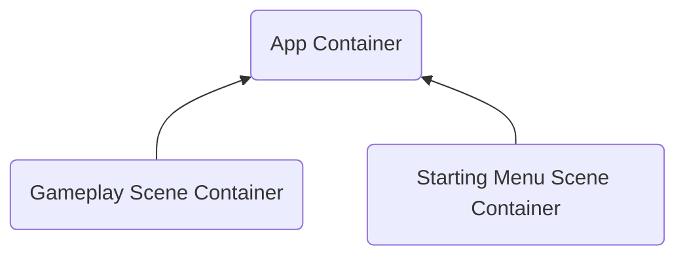
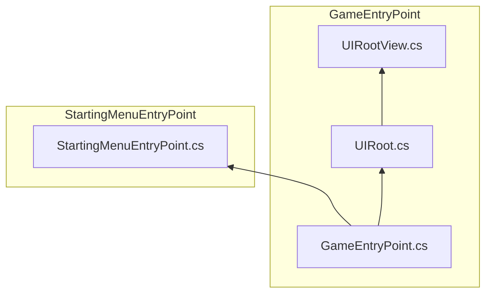

# AuroraWorld

## Архитектура проекта

### DI Containers

```mermaid
flowchart BT
    StartingMenuSceneContainer(Starting Menu Scene Container)
    GameplaySceneContainer(Gameplay Scene Container)
    AppContainer(App Container)
    
    GameplaySceneContainer --> AppContainer
    StartingMenuSceneContainer --> AppContainer
```

### Entry point app

```mermaid
flowchart BT
    subgraph GameEntryPoint 
    GameEntryPoint.cs --> UIRoot.cs
    UIRoot.cs --> UIRootView.cs
    
    end


subgraph StartingMenuEntryPoint
    GameEntryPoint.cs --> StartingMenuEntryPoint.cs
end
    
```
