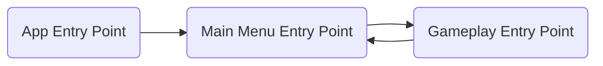
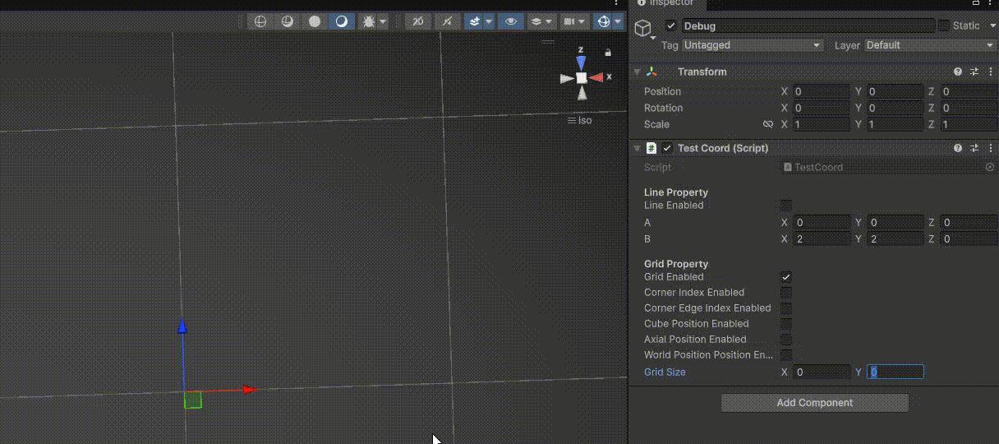
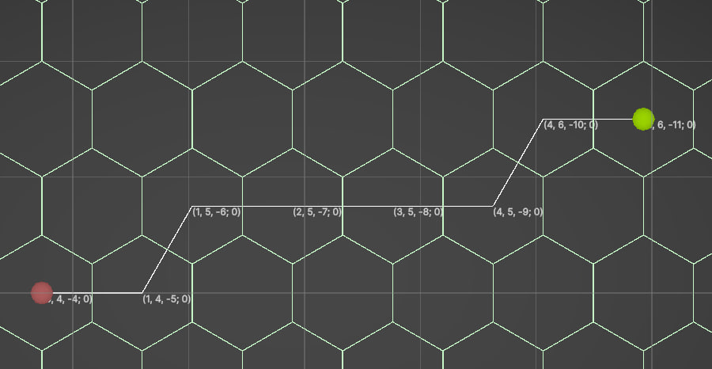
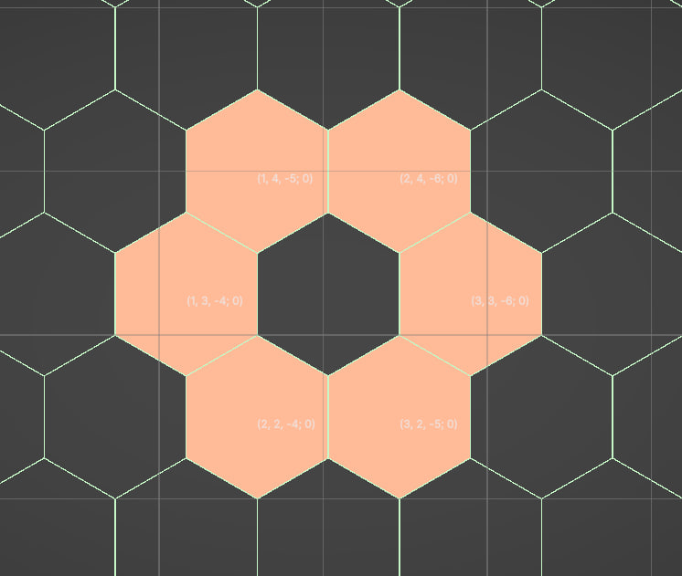
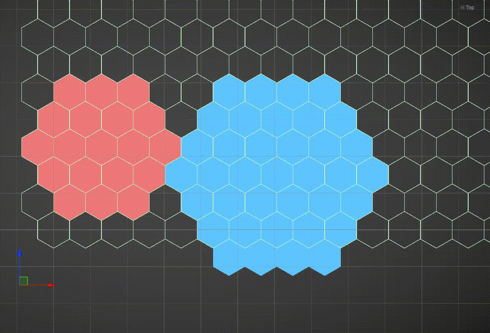
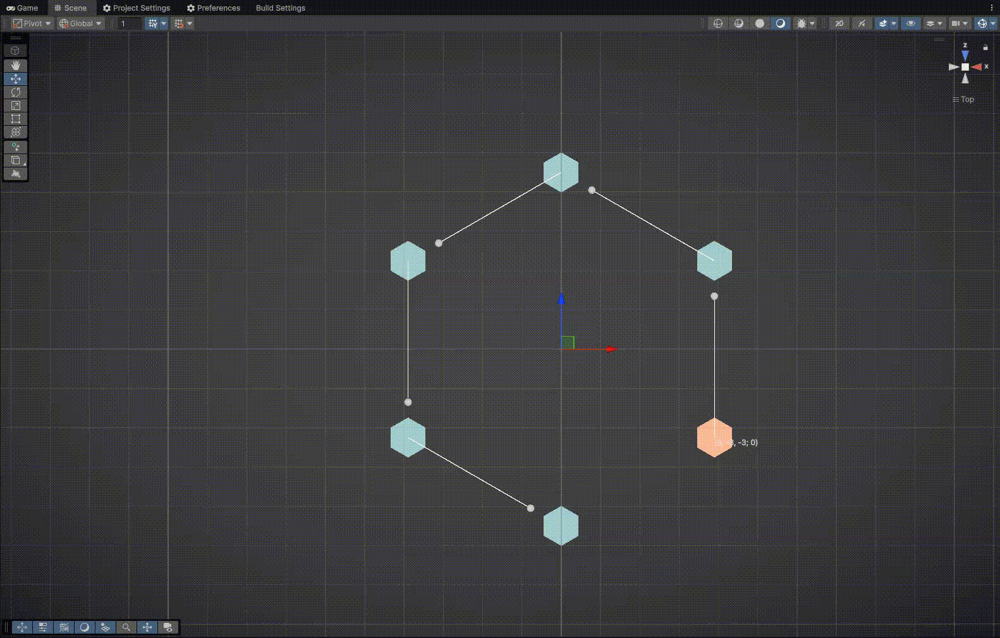
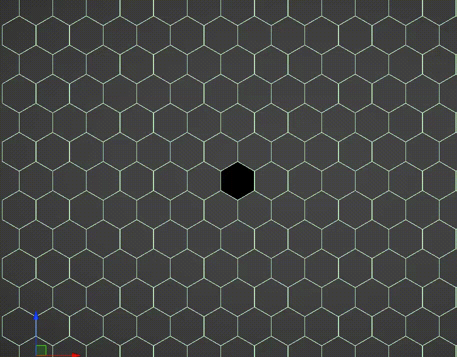
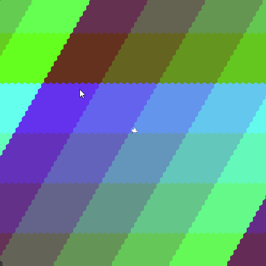

# AuroraWorld [DEMONSTRATION]

Тут будет описаны игровые системы моего Pet-проекта. Всякие нароботки и скрины результатов

## Описание игры
Игроку предстоит создать свое поселение в мире, состоящем из шестиугольников. 
Этот уникальный ландшафт предоставляет широкие возможности для стратегического планирования 
и развития вашей цивилизации.

Ваша задача начинается с малого: 
основать первое поселение, построить первые здания и начать добывать жизненно важные ресурсы. 
По мере роста вашего города вам предстоит:

**Развивать своих персонажей:** Набирать и обучать жителей вашего поселения. 
Каждый персонаж обладает уникальными навыками и способностями, которые помогут в строительстве, 
добыче ресурсов, исследованиях или защите. Отправляйте их на задания, повышайте их уровень и 
открывайте новые таланты.

**Изучать технологии:** Исследуйте древние знания и создавайте новые технологии, 
которые откроют доступ к более продвинутым зданиям, мощному оружию, эффективным методам производства 
и новым возможностям для экспансии.

**Защищаться от набегов:** Мир полон опасностей. Ваше поселение будет подвергаться атакам диких зверей, мародеров. 
Стройте укрепления, тренируйте войска и разрабатывайте стратегии защиты, чтобы сохранить свои достижения.

**Исследовать мир:** Шестигранная карта мира таит множество секретов. Отправляйте разведчиков и экспедиции 
за пределы ваших владений, чтобы открывать новые территории, находить редкие ресурсы, обнаруживать древние руины 
и сталкиваться с новыми вызовами и возможностями.

**Ваша цель** – построить процветающую империю, выжившую в суровых условиях этого мира, 
и стать доминирующей силой на шестигранной карте. Каждое ваше решение в развитии поселения, 
управлении ресурсами, подготовке к битве и выборе направлений исследований будет иметь последствия, 
формируя вашу уникальную историю успеха или провала.

## Архитектура проекта
Вход в игру сделан с использованием паттерна проектирования Entry Point:

# Генерация мира:

## Демонстрация генерации мира
Для генерации используются Job система + многопоточность

## Возможности
### Grid

### Line

### Neighbors

### Область (Обычная)

### Область (Спиральная)

### Пересечение областей

### Поворот на 60* относительно центра

### Кольцо

### Визуализация чанков

