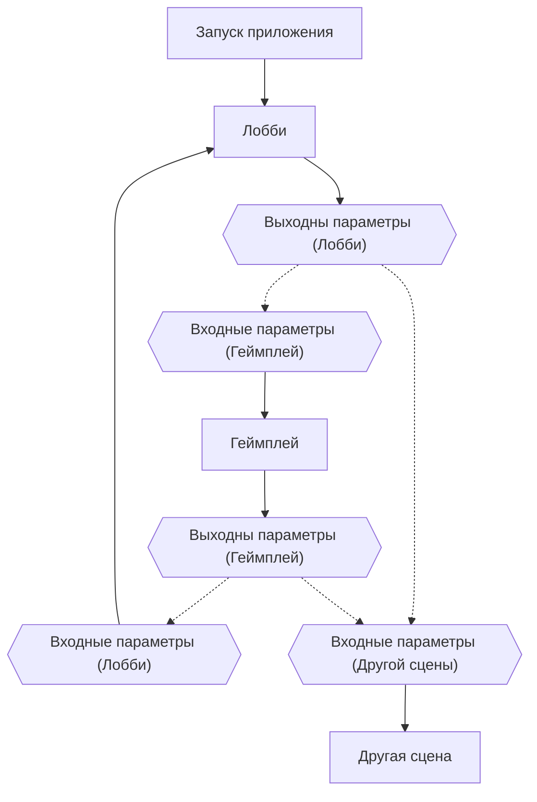

# AuroraWorld

## Архитектура проекта

#### Архитектура сцен



## Modules

### Storage

Storage - модуль для сохранения результатов игры.<br>
Примеры использования:

```csharp
// Регистрация модуля
container.RegisterSingleton(_ => new Storage());

// Получение модуля
var storage = container.Resolve<Storage>();

// Сохранение объекта
storage.Save(tag, obj);

// Получение объекта
var obj = storage.Load(tag, defaultObj);
```

### Resource

Resource - модуль для получения объектов из ресурсов<br>
Примеры использования:

```csharp
// Регистрация модуля
container.RegisterSingleton("name", _ => new Resource<T>()); // where T : Object

// Получение модуля
var resource = сontainer.Resolve<Resource>();

// Получение ресурса
T obj = resource.Load("path");
```