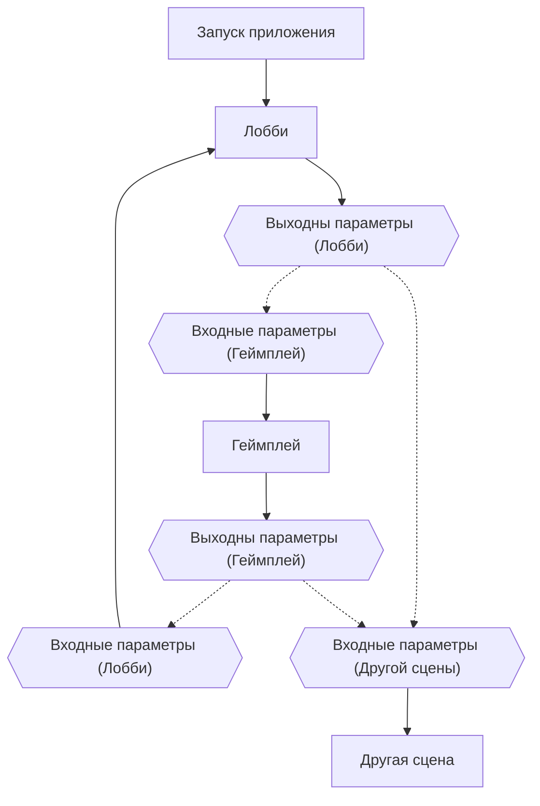
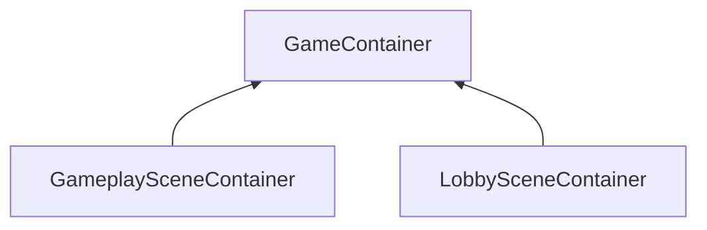

# AuroraWorld

## Архитектура проекта

#### Архитектура сцен

## Containers


## Modules
### Storage
Сохранение игровых данных проекта. Зарегестрирован в `GameContainer`, 
для получения -> `container.Resolve<Storage>();`<br>
В `Storage` есть методы:
* `Observable<T> Load<T>(string tag, T defaultObj = default)` - получение объекта. <br>
Чтобы получить сам объект, ипользуйте `Load<T>().Subscribe(T => ...);`
* `Observable<bool> Save<T>(string tag, T obj)` - запись объекта. <br>
**ОБЯЗАТЕЛЬНО:** `Save<T>().Subscribe(T => ...);` даже если не нужно проверять успешность операции.

### Resource
Позволяет немного оптимизировать процесс получения ресурсов из проекта
путем кеширования ресурсов определенного типа внутри себя. <br>
Как использовать:
```csharp
var resource = new Resource<T>();
var asset = resource.Load("asset path");
```
